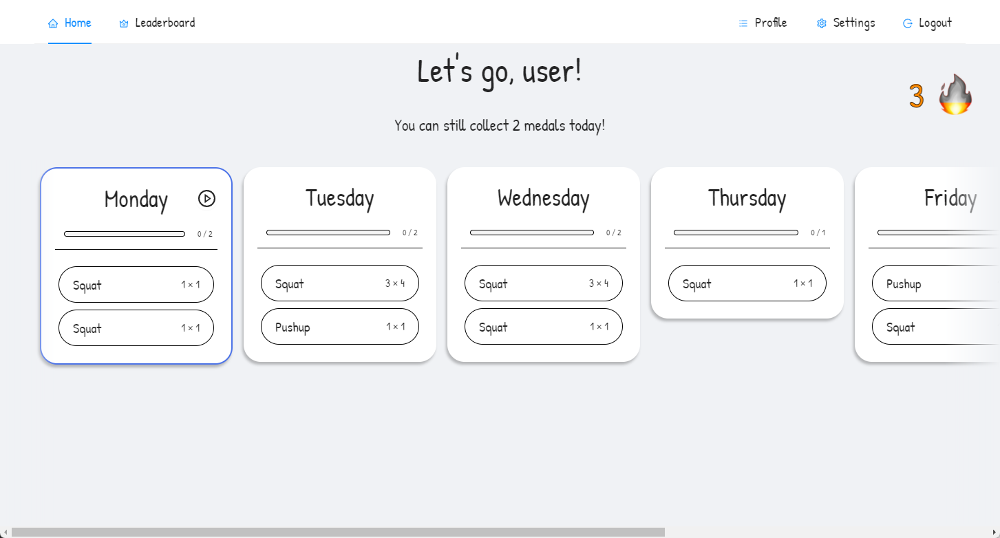
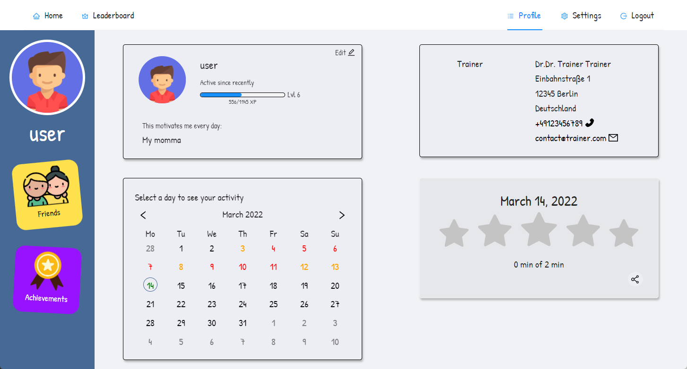

<h1 align="center">
   
  Momentum
</h1>

  

  
  
  
  
  
  

## About

Momentum is a WebApp designed to help hemophiliacs to exercise and thus counteract the progression of the disease.
By assigning a plan of exercises to a patient, the patient can execute these exercises while being supervised by an AI running on the backend. This way, the patient can be sure that the exercises are being executed correctly.

  
  

## Getting Started

### Prerequisites

  * `Yarn` is required to install the dependencies.
  * The [backend](https://github.com/BP-WiSe21-22-Gruppe-52/BP-backend) is required to run on a server.
  * A CDN is running with [these](#CDN) files.

### Configuration

  * Configure the server in the [`config/index.ts`](src/config/index.ts) file.

### Automatic Workflow Deploy

  * Configure the workflow in the [`.github/workflows/deploy.yml`](.github/workflows/deploy.yml) file.

### Manual Installation

  * Run `yarn` to install the dependencies.
  * Build the static page using `yarn build`.
  * Host it anywhere!

## Contributing

To contribute to this project, please open an issue or create a pull request.

## Available Scripts

In the project directory, you can run:

### `yarn`

Installs all the necessary packages. Run this after every pull or checkout.

### `yarn start`

Runs the app in the development mode.\
Open [http://localhost:3000](http://localhost:3000) to view it in the browser.

The page will reload if you make edits.\
You will also see any lint errors in the console.

### `yarn test`

Launches the test runner in the interactive watch mode.\
See the section about [running tests](https://facebook.github.io/create-react-app/docs/running-tests) for more information.

### `yarn build`

Builds the app for production to the `build` folder.\
It correctly bundles React in production mode and optimizes the build for the best performance.

The build is minified and the filenames include the hashes.\
Your app is ready to be deployed!

## CDN

A CDN is required to host the app.
The following files are required:

### Avatars

There need to be a total of `n + 1` avatar images where `n` is the size of the range specified in the settings file.
The ID 0 is reserved for the default avatar and thus the range starts at 1.
The exact scheme can be modified in the settings file.
For the default configuration, the images are stored according to the following scheme:

  * `avatars/avatar_0.png`
  * `avatars/avatar_1.png`
  * `avatars/avatar_2.png`
  * ...
  * `avatars/avatar_51.png`

### Sound Files (for auditive Feedback)

For the audio files 4 categories are required:
"good", "better", "best" and "perfect".

Each category has an arbitrary amount of files specified in the settings file.

The default URL scheme looks the following:

  * `sounds/<category>/<filename>` where the category is one of the above and the filename is the name of the file as specified in the categories list in the settings file.